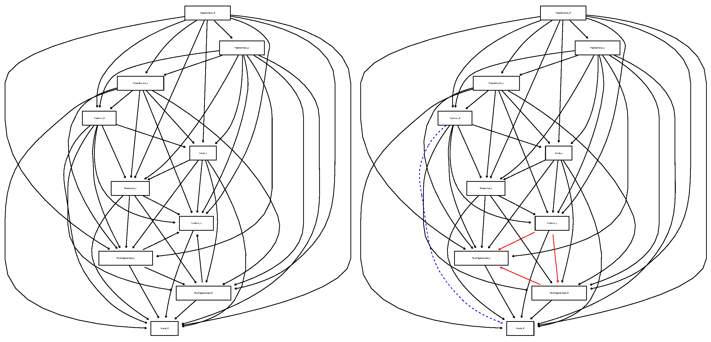

# Bayesian Networks for Estimating Brain Effective Connectivity in Resting-State fMRI Data. 

## Overview
In this project, the Bayesian Networks (BNs) is used to estimate the effective connectivity in resting-state fMRI data. We constructed BNs of brain nodes of the hippocampus regions and brain nodes with time courses strongly correlated with the time courses of the hippocampus regions in the resting-state fMRI data from the Alzheimer’s Disease Neuroimaging Initiative (ADNI). The Metropolis-Hastings Algorithm is used for finding maximum a posteriori probability estimate of the BNs. These BNs revealing the functional activities among brain regions and alterations of the effective connectivity of the subject with Alzheimer’s Disease. 

## Results
  

## Guideline for this repository
- `helper_function.R` provides the functions in R code for this project.
- `BN.qmd` includes the whole process of the data analysis.
- Key resulted images are in the folder `images`.
